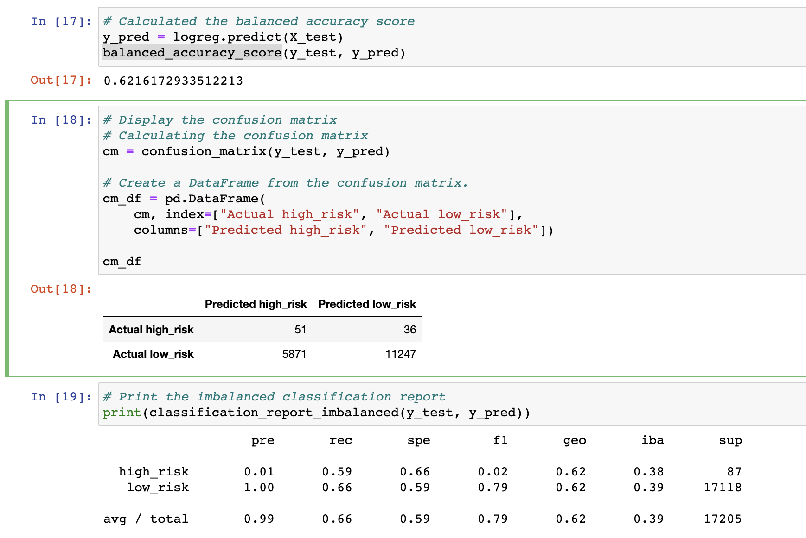
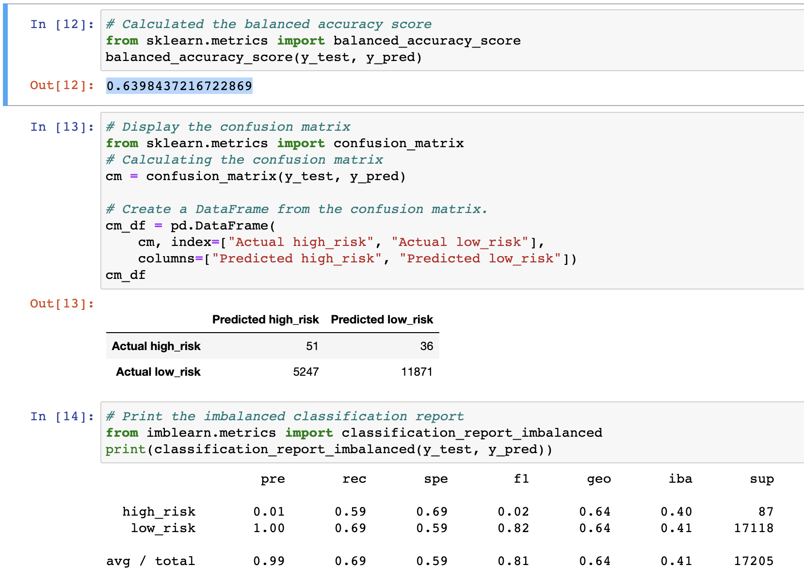
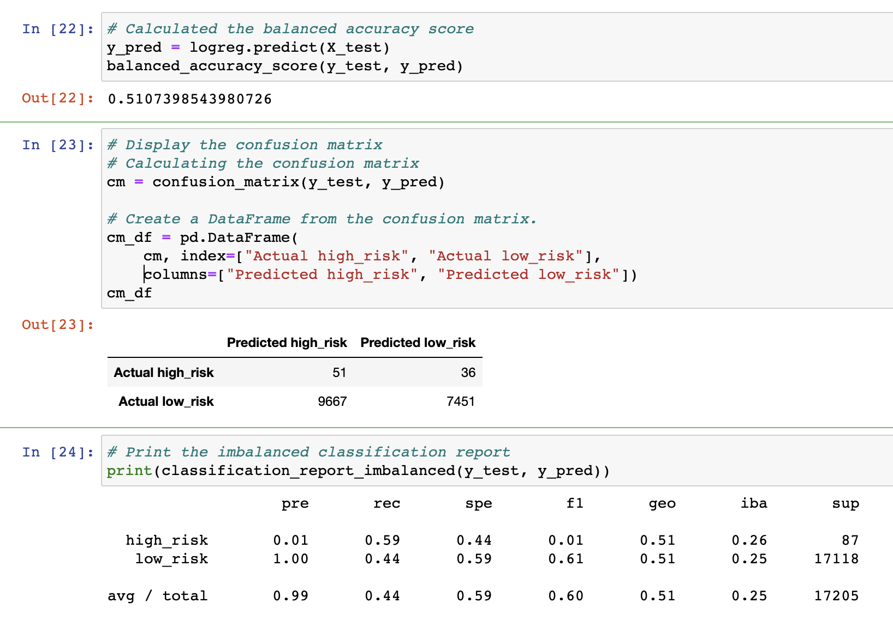
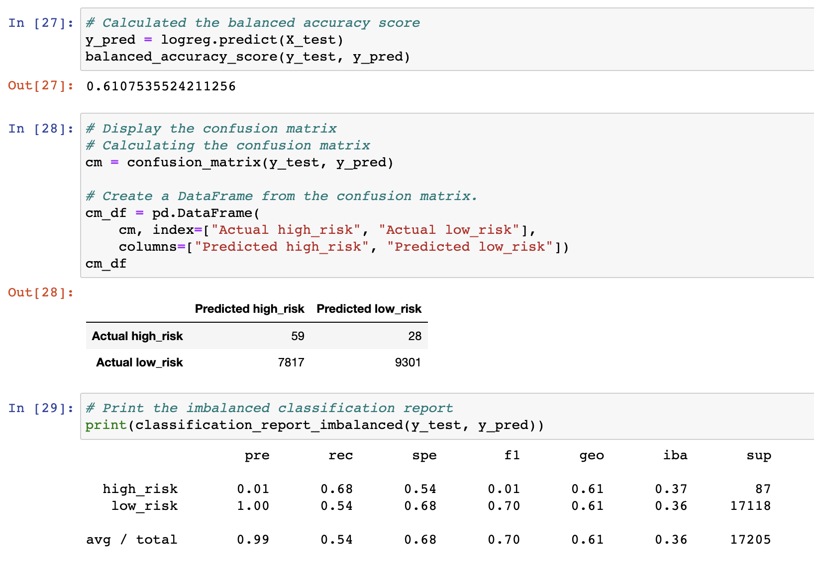
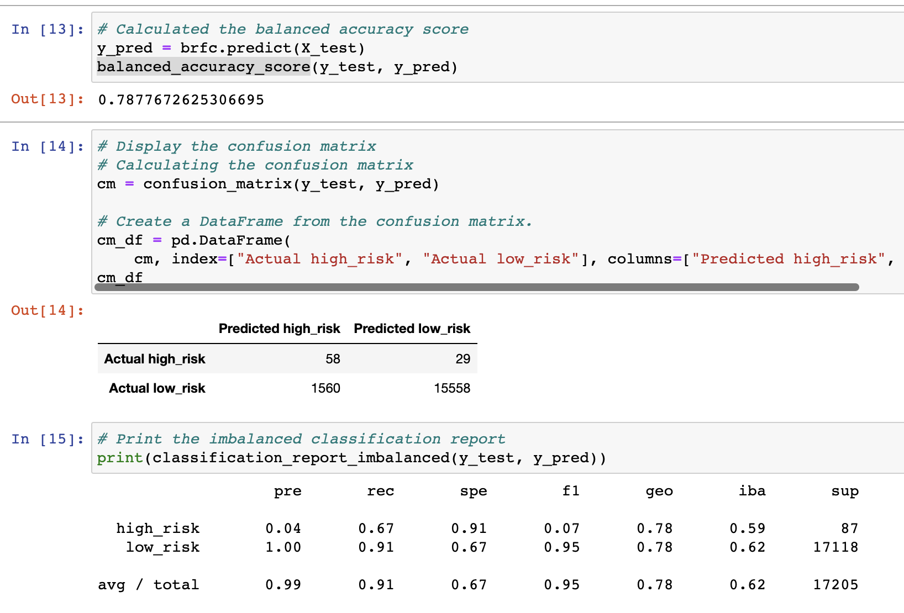
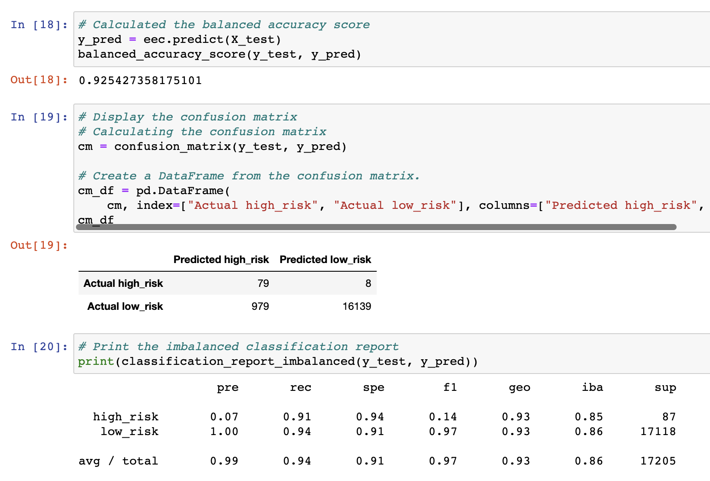

# Credit_Risk_Analysis

## Overview
With the help of `imbalanced-learn` and `scikit-learn` we will build and evaluate models using resampling which will help us evalute the credit risk. We will be using algorithims such as as `RandomOverSampler` and `SMOTE` to oversample the data and we will use `ClusterCentroids` to undersample the data. We will then compare the two machine learning models (`BalancedRandomForestClassifier` and `EaseEnsembleClassifier`) and detrime which if any should be used to predict **credit risk**

## Results
### 1. Random Oversampling

The balanced accuracy score is: `0.6216172933512213` which is **`62%`**
The high_risk precision is about 1% only with a 59% senstivity, which we can see makes an f1 of only 2%.
Due to the high number of the low_risk population, its precision is almost 100% with a sensitivity of 66%.

  

### 2. SMOTE 
The balanced accuracy score is: `0.6398437216722869` which is **`63%`**
The high_risk precision is about 1% only with a 59% senstivity, which we can see makes an f1 of only 2%.
Due to the high number of the low_risk population, its precision is almost 100% with a sensitivity of 69%.

  

### 3. ClusterCentroids
The balanced accuracy score is: `0.5107398543980726` which is **`51%`**
The high_risk precision is about 1% only with a 59% senstivity, which we can see makes an f1 of 1% also.
Due to the high number of the low_risk population, its precision is almost 100% with a sensitivity of 44%.

  

### 4. SMOTEENN
The balanced accuracy score is: `0.6107535524211256` which is **`61%`**
The high_risk precision is about 1% only with a 68% senstivity, which we can see makes an f1 of 1% also.
Due to the high number of the low_risk population, its precision is almost 100% with a sensitivity of 54%.

  

### 5. BalancedRandomForestClassifier
The balanced accuracy score is: `0.7877672625306695` which is **`78%`**
The high_risk precision is about 4% only with a 67% senstivity, which we can see makes an f1 of 7% also.
Due to the high number of the low_risk population, its precision is almost 100% with a sensitivity of 91%.

  

### 6. EasyEnsembleClassifier
The balanced accuracy score is: `0.925427358175101` which is **`92%`**
The high_risk precision is about 7% only with a 91% senstivity, which we can see makes an f1 of 14% also.
Due to the high number of the low_risk population, its precision is almost 100% with a sensitivity of 94%.

  

## Summary

- All the models used to perform the credit risk analysis show weak precision in determining if a credit risk is high.
- The Ensemble models brought a lot more improvment specially on the sensitivity of the high risk credits.
- The EasyEnsembleClassifier model shows a recall of 92% so it detects almost all high risk credit. - On another hand, with a low precision, a lot of low risk credits are still falsely detected as high risk which would penalize the bank's credit strategy and infer on its revenue by missing those business opportunities.
- For those reasons I would not recommend the bank to use any of these models to predict credit risk.
